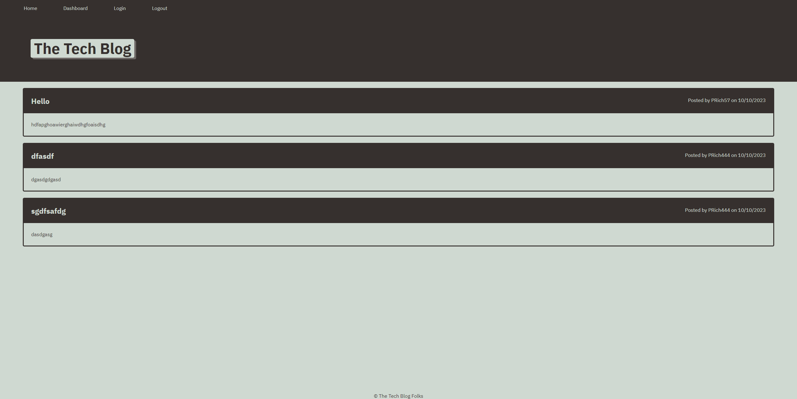

# Tech Blog

## Description

  This is a Content Management System (CMS) for creating and managing blog posts. Users can sign up, create, edit, and delete blog posts, leave comments, and more. The project is built following the user stories listed below.

  To visit the live CMS site click [here!](#)

## Table of Contents

  - [Installation](#installation)
  - [Usage](#usage)
  - [Mock-Up](#mock-up)
  - [License](#license)
  - [Contributing](#contributing)

## Installation

  N/A

## Usage

  To use the CMS Tech Blog, visit the url included in the Description section above. When on the site, select the navigation link 'Login' to see prompts for either logging in or signing up. If this is your first time on the blog, select 'Sign up instead' to create your account. After your account is created, you will have access to the rest of the site. From here, you can select the '+ New Post' button at the bottom of the page to create your first post. Be sure to include a title and some content with your posts. When you are finished with your post, click the 'Create' button under the content textarea to submit. You will then be automatically redirected to the Dashboard where you will be able to see the posts you've created. Click on any of your existing posts to be able to delete them from the database or update the existing content.

  If you select 'Home' in the navigation menu, you will be taken to the home page where you can view all blog posts. If you click the 'Logout' option in the navigation menu, you will be logged out and automatically redirected to the home page, where you can view all blog posts.

## Mock-Up

  The following image shows the application's design and functionality.

  

## License

  N/A

## Contributing

  All contributions are welcome and should be done with the following process:

  1. Clone this repository to your local machine.
  2. Create a new branch to work on your additions or modifications.
  3. Commit your changes and push them to your branch.
  4. Open a pull request on GitHub for review.
  5. I will review your contributions and work with you to merge them into the main project.
